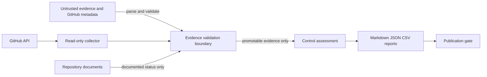

# Repository Threat Model

## Classification

Category: Category C — Architectural Proposals
Evidence level: Level D — Internal Proposal or Convention
Approval status: Proposta
Origin: Repository source review, 2026-08-23
Justification: Define the security boundaries of the assessment tooling without asserting a deployed SaaS runtime.

## Scope and assets

The modeled system is the repository-local evidence assessment pipeline. Protected assets are evidence authenticity, control status, report integrity, repository credentials, workflow permissions and publication-safe outputs. A SaaS runtime, cloud account and customer data are outside the observed scope.

## Actors, entry points and trust boundaries

Actors include maintainers, pull-request contributors, CI runners, GitHub API callers and evidence providers. Entry points are JSON/CSV/Markdown files, Git metadata, GitHub API responses, command-line arguments and dependency/workflow updates.

Trust boundaries are: external provider to collector; repository input to parser; evidence model to status calculation; report generator to publication; and pull-request content to CI.

## STRIDE analysis

| Threat | STRIDE | Attack path | Implemented mitigation | Residual risk / status |
|---|---|---|---|---|
| Malicious or poisoned evidence | Tampering / Spoofing | Crafted primitive shape, status, source, scope, key or notes promotes a control | Authoritative per-key requirements; strict runtime shape/status validation independent of JSON Schema; parity and negative tests | Legacy records not referenced by the control catalog are retained but cannot promote unknown keys / bounded |
| Placeholder target accepted | Spoofing | Synthetic account, URL or service ID appears real | Reserved-token, URL, domain, provider and binding validation | Semantic ownership still requires human or provider evidence / open |
| Evidence tampering or staleness | Tampering | Old, edited or cross-key export is reused | Three-way SHA-256 validation, expected-context evidence-key binding and freshness policy enforced for external operational promotion; negative tests | Unsigned collector identity and authoritative-digest distribution remain external concerns / open |
| Path or symlink traversal | Tampering / Elevation | Crafted path escapes evidence root | Repository-local JSON ingestion uses bounded regular-file reads and rejects symlinks, oversized, binary and malformed input | Ingestion is limited to an enumerated repository-local file set; arbitrary external paths remain unsupported / bounded |
| Command or shell injection | Elevation | Untrusted metadata reaches a shell | `execFileSync` with argument arrays in collectors | GitHub CLI output remains untrusted input / monitored |
| JSON/CSV/Markdown injection | Tampering | Data changes report structure or spreadsheet behavior | JSON parsing; CSV quoting and formula-prefix neutralization; Markdown table escaping; tests | Other downstream renderers may require context-specific encoding / open |
| Compromised dependency/action | Elevation | Supply-chain component runs in CI | lockfile, frozen install, full Action SHAs, Dependabot, dependency review | Registry/provenance verification depends on external services / unverified |
| Token over-privilege | Elevation / Disclosure | Workflow token modifies repository or leaks data | read-only defaults; scoped CodeQL write permission; checkout credentials disabled | Repository settings require remote evidence / unverified |
| Accidental secret publication | Information disclosure | Credential appears in source, fixture, log or report | local scanner and GitHub secret controls | Local regex scanner is not exhaustive / open |
| False-positive promotion | Tampering | Documentation or a self-selected discriminator becomes observed control | Authoritative per-key requirement metadata, unknown-key denial and fail-closed promotability tests | Classification metadata requires maintainer review when the catalog changes / open |
| False-negative suppression | Repudiation | Malformed input or unavailable API is treated as pass | explicit gaps and warnings; tests | Remote error taxonomy requires further strengthening / open |
| CI bypass or malicious PR | Elevation | Unsafe workflow expression or missing required check | pinned actions, read-only permissions, PR workflows | Branch/ruleset state is external and must be re-collected / unverified |
| Unauthorized publication | Information disclosure | Private provenance or secrets enter public output | publication and secret gates | Human release authorization remains required / open |

## Security invariants

1. `UNVERIFIED` cannot become sufficient without new promotable evidence.
2. Documentation cannot prove runtime effectiveness.
3. Provider presence cannot prove product binding.
4. Evidence requirements come from central metadata keyed by the expected evidence key; unknown requirements fail closed.
5. External operational evidence requires a compatible target, two distinct binding signals, freshness, a verification method, SHA-256 integrity metadata and independently supplied expected context bound to the evidence key and payload digest.
6. API inaccessibility is `UNVERIFIED` or `UNAVAILABLE`, never automatic `PASS` or confirmed `FAIL`.

Owner: repository maintainer. Status: Proposta. Review when ingestion paths, providers or publication automation change.
