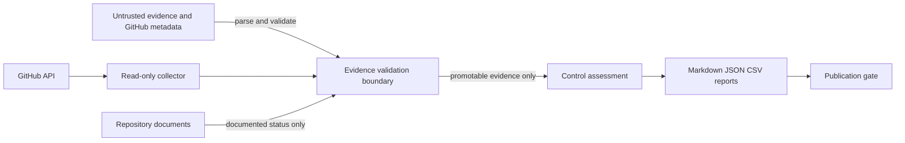

# Repository Threat Model

## Classification

Category: Category C — Architectural Proposals
Evidence level: Level D — Internal Proposal or Convention
Approval status: Proposta
Origin: Repository source review, 2026-08-23
Justification: Define the security boundaries of the assessment tooling without asserting a deployed SaaS runtime.

## Scope and assets

The modeled system is the repository-local evidence assessment pipeline. Protected assets are evidence authenticity, control status, report integrity, repository credentials, workflow permissions and publication-safe outputs. A SaaS runtime, cloud account and customer data are outside the observed scope.

## Actors, entry points and trust boundaries

Actors include maintainers, pull-request contributors, CI runners, GitHub API callers and evidence providers. Entry points are JSON/CSV/Markdown files, Git metadata, GitHub API responses, command-line arguments and dependency/workflow updates.

Trust boundaries are: external provider to collector; repository input to parser; evidence model to status calculation; report generator to publication; and pull-request content to CI.

## STRIDE analysis

| Threat | STRIDE | Attack path | Implemented mitigation | Residual risk / status |
|---|---|---|---|---|
| Malicious or poisoned evidence | Tampering / Spoofing | Crafted source, scope or notes promotes a control | `evidence-validation.ts`; negative tests | Schema coverage of legacy records remains partial / open |
| Placeholder target accepted | Spoofing | Synthetic account, URL or service ID appears real | Reserved-token, URL, domain, provider and binding validation | Semantic ownership still requires human or provider evidence / open |
| Evidence tampering or staleness | Tampering | Old or edited export is reused | SHA-256 metadata required for external promotion | Timestamp freshness policy not yet enforced / open |
| Path or symlink traversal | Tampering / Elevation | Crafted path escapes evidence root | No general user-selected ingestion path currently exists | Must be implemented before adding arbitrary path ingestion / accepted boundary |
| Command or shell injection | Elevation | Untrusted metadata reaches a shell | `execFileSync` with argument arrays in collectors | GitHub CLI output remains untrusted input / monitored |
| JSON/CSV/Markdown injection | Tampering | Data changes report structure or spreadsheet behavior | JSON parsing; CSV quoting; Markdown table escaping | CSV formula-prefix neutralization is not yet implemented / open |
| Compromised dependency/action | Elevation | Supply-chain component runs in CI | lockfile, frozen install, full Action SHAs, Dependabot, dependency review | Registry/provenance verification depends on external services / unverified |
| Token over-privilege | Elevation / Disclosure | Workflow token modifies repository or leaks data | read-only defaults; scoped CodeQL write permission; checkout credentials disabled | Repository settings require remote evidence / unverified |
| Accidental secret publication | Information disclosure | Credential appears in source, fixture, log or report | local scanner and GitHub secret controls | Local regex scanner is not exhaustive / open |
| False-positive promotion | Tampering | Documentation becomes observed control | fail-closed promotability rules | Legacy simple evidence remains lower assurance / open |
| False-negative suppression | Repudiation | Malformed input or unavailable API is treated as pass | explicit gaps and warnings; tests | Remote error taxonomy requires further strengthening / open |
| CI bypass or malicious PR | Elevation | Unsafe workflow expression or missing required check | pinned actions, read-only permissions, PR workflows | Branch/ruleset state is external and must be re-collected / unverified |
| Unauthorized publication | Information disclosure | Private provenance or secrets enter public output | publication and secret gates | Human release authorization remains required / open |

## Security invariants

1. `UNVERIFIED` cannot become sufficient without new promotable evidence.
2. Documentation cannot prove runtime effectiveness.
3. Provider presence cannot prove product binding.
4. External evidence requires a compatible target, two distinct binding signals, a verification method and integrity metadata.
5. API inaccessibility is `UNVERIFIED` or `UNAVAILABLE`, never automatic `PASS` or confirmed `FAIL`.

Owner: repository maintainer. Status: Proposta. Review when ingestion paths, providers or publication automation change.
